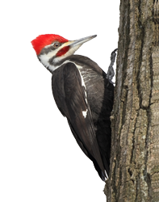

peck
===
Checks a domain to see if it is available
___



Exits 0 if the domain is available, else exits > 0

#### To check a domain
```domain_pecker $domain```

#### Lambda
It can also be used as a lambda function by providing an environment variable:

`IS_LAMBDA=true`

#### Development
To package for Lambda:

`go run mage.go package` or `mage package`
